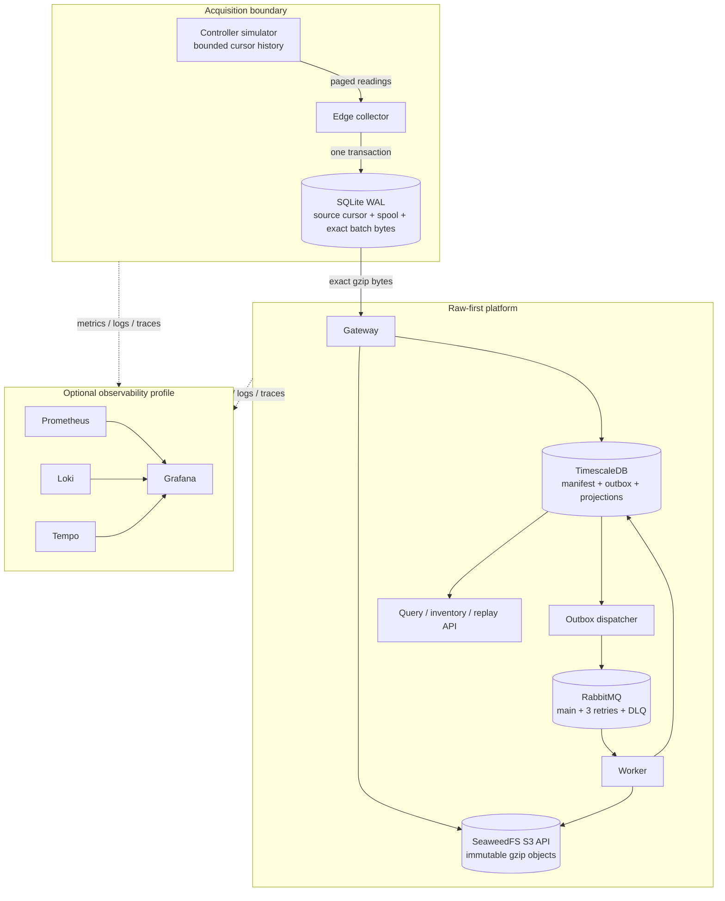

# Architecture

## Scope and trust boundary

Industrial Telemetry Lab models one fictional control system, one edge collector, twelve empty equipment-enclosure zones, and three mapped signals per zone. The entire deployment is one local Docker Compose project. The host and its loopback interface are the outer trust boundary; no cloud or external identity system participates.

## Component boundaries

| Component | Owns | Must not do |
| --- | --- | --- |
| Simulator | Seeded signal generation, process-lifetime source epoch, bounded sequence history, cursor-gap response, fault controls | Persist business data or infer collector recovery |
| Collector | Source cursor, SQLite durability, watermarks, deterministic batching, exact compressed retry bytes, heartbeat | Advance a cursor before readings are durable or rebuild a payload during retry |
| Gateway | Bounded validation, digest verification, deterministic object key, raw-store reconciliation, manifest/outbox transaction | Return success before both durability sides exist or overwrite different bytes |
| Dispatcher | Claim unpublished rows, publish persistent references with confirms, mark confirmed events | Put raw telemetry in RabbitMQ or claim exactly-once publication |
| Worker | Fetch and verify raw bytes, map, validate, deduplicate, write canonical/audit state, manually acknowledge | Trust queue content as raw truth or acknowledge before commit |
| Replay | Select overlapping manifests, filter exact event interval, pin mapping/rules versions, rate-limit dispatch | Mutate raw input or depend on an unspecified current mapping |
| Query API | Event-time filters, keyset pagination, registry, batch/rejection inspection | Provide unbounded scans or offset pagination |

`telemetry-contracts` contains DTOs, schemas, deterministic identity/digest utilities, and reason-code enums only. Vendor clients and service logic stay in their owning modules.

## Acquisition and batching

The simulator emits 36 readings every five seconds by default: twelve zones multiplied by temperature, relative humidity, and pressure. Its in-memory history retains 250,000 observations. A process restart creates a new random `sourceEpoch` and resets the sequence; seeded values remain reproducible.

The collector writes each page and its cursor in one short SQLite transaction using WAL, `synchronous=FULL`, foreign keys, a 5-second busy timeout, and a single writer connection. A cursor that has fallen outside simulator history produces a durable visible gap state; only the authenticated recovery endpoint can choose a new cursor.

Unsent rows become batches of at most 500 observations or five seconds of age. Serialization and deterministic gzip occur once. The batch ID, compressed BLOB, SHA-256 checksum, RFC `Content-Digest`, item ordering, state, attempts, and next retry time are committed before upload. The spool pauses polling at 80% of 100,000 rows and resumes at 60%.

## Gateway acknowledgment transaction

1. Bound the compressed request to 1 MiB while calculating SHA-256.
2. Compare `Content-Digest` before parsing.
3. Bound decompression to 10 MiB and validate the envelope, identifiers, fields, version, and 500-observation limit.
4. Acquire a transaction-scoped PostgreSQL advisory lock derived from `batchId`.
5. Recheck the manifest after acquiring the lock.
6. write the raw object with create-if-absent semantics at a gateway-receipt-time partitioned key.
7. If it already exists, require identical digest metadata; otherwise return `409` and never overwrite.
8. Insert `ingestion_batch` and `outbox_event` in one PostgreSQL transaction.
9. Commit, then return success. The collector marks its local batch acknowledged only after that response.

There is intentionally no distributed transaction across S3-compatible storage and PostgreSQL. A crash after step 6 can leave an orphan object. Retrying the same ID and bytes recognizes the object and repairs the missing manifest/outbox state. The authenticated reconciliation endpoint reports both orphan and missing objects without deleting either.

## Asynchronous processing

The dispatcher uses `FOR UPDATE SKIP LOCKED`, mandatory persistent messages, publisher confirms, and trace headers. A crash after a positive confirm but before `published_at` commits can send the same reference twice. That is the principal expected duplicate window.

RabbitMQ uses durable quorum queues `telemetry.main`, `telemetry.retry.short` (5 seconds), `telemetry.retry.medium` (30 seconds), `telemetry.retry.long` (120 seconds), and `telemetry.dead-letter`. Each has a 50 MiB byte limit and reject-publish overflow. Consumers manually acknowledge. A retry is republished with publisher confirmation before the original delivery is acknowledged; a terminal failure is confirmed into the permanent DLQ first.

The worker reads the referenced object, verifies its checksum, repeats boundary validation, and uses the pinned mapping/rules versions. In one database transaction it inserts `telemetry_sample_identity`, inserts a canonical hypertable row only for a new identity, records a processing attempt and rejections, updates counters/status, and commits. Duplicate delivery therefore creates an observable duplicate outcome but no second canonical sample.

## Time and identity model

- `observed_at` is source event time and drives query ordering and the TimescaleDB daily chunk.
- `received_at` is trusted gateway time and drives raw-object partitioning.
- `processed_at` is worker time and completes freshness measurement.
- Observation identity is SHA-256 over facility ID, source system, source epoch, source sequence, and source tag using length-delimited canonical encoding.
- The ordinary `telemetry_sample_identity` primary key provides global uniqueness across TimescaleDB chunks. The hypertable primary key includes event time as TimescaleDB requires.
- Out-of-order sequence or event time remains queryable and is flagged. A timestamp too far in the future is rejected so it cannot corrupt latency SLOs.

## Replay

A replay request is limited to 24 hours and must name immutable mapping and quality-rule versions. PostgreSQL permits one `PENDING` or `RUNNING` replay at a time. Batch selection uses manifest min/max overlap; worker evaluation filters each observation to the exact requested interval. Live and replay share mapping, validation, identity, and persistence code, but separate processing context and queue scheduling prevent replay from becoming a second ingestion path.

Rejected observations are deliberately absent from `telemetry_sample_identity`, so a later mapping can accept them. The rejection audit has an idempotency constraint across observation, batch, versions, replay context, and reason. Replaying an already accepted observation records a duplicate without multiplying the canonical row.

## Deployment and observability

Core Compose services start without a profile. Prometheus, Grafana, Loki, Tempo, Alloy, and the OpenTelemetry Collector are in the `observability` profile. A one-shot migration service completes before gateway and worker start; application connection retries remain necessary after startup.

Application metrics use bounded labels. JSON logs go to stdout and bounded rolling files on a read-only shared log volume. Alloy sends those files to Loki without mounting the Docker socket. OpenTelemetry auto-instruments HTTP, JDBC, and messaging, while explicit spans cover SQLite, raw storage, mapping, replay, and outbox work. W3C context crosses HTTP, the outbox row, and RabbitMQ.

All data services are single-node demonstrations. Quorum-queue semantics do not create broker high availability with one RabbitMQ node, and no local component provides disaster recovery.
