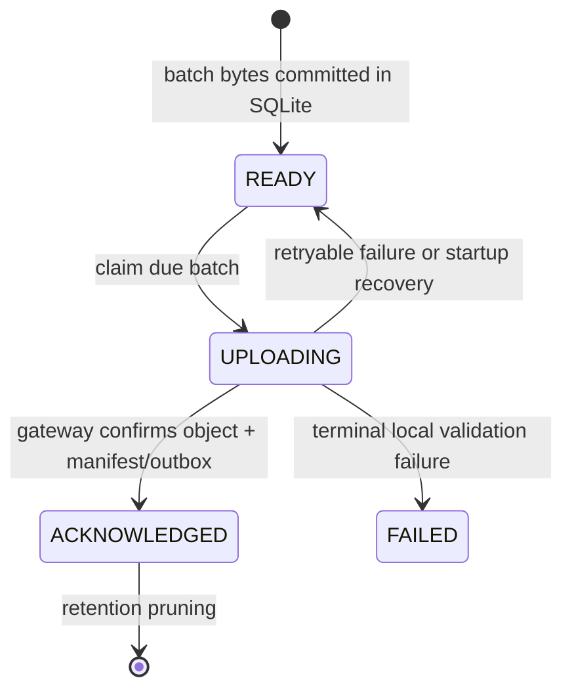
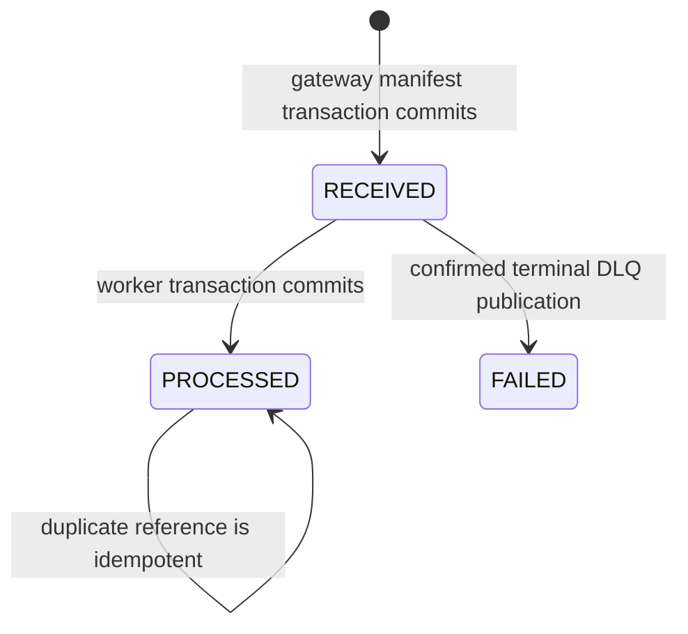

# Failure semantics

The project uses at-least-once movement plus idempotent outcomes. A timeout or crash is treated as unknown completion, so the safe response is to retry the same durable identity and bytes.

## State transitions

## Crash and outage matrix

| Boundary | Durable state at failure | Recovery | Observable evidence |
| --- | --- | --- | --- |
| Source page before SQLite commit | Cursor is unchanged | Poll the same page again | No cursor advance; transaction rollback |
| SQLite commit before next source poll | Reading and cursor are both durable | Continue at committed cursor | Spool count and cursor survive restart |
| Batch creation | Either the full exact batch transaction commits or no batch exists | Select unsent rows again | Stable batch ID, checksum, item order |
| Collector during upload | `UPLOADING` batch and exact BLOB remain | Startup returns it to retry; send identical bytes | Retry counter and same digest |
| Gateway unavailable or overloaded | Collector spool remains source of pending delivery | Exponential bounded retry; polling continues until high water | Upload failures, growing spool, older unsent age |
| Request reaches gateway but response is lost | Completion is unknown to collector | Retry same batch ID/bytes | Gateway returns idempotent success for identical digest |
| Raw write before PostgreSQL commit | Object can exist without manifest | Same request sees matching object and commits manifest/outbox | Reconciliation reports orphan until repaired |
| Concurrent same ID/same bytes | Advisory lock serializes checks | Both receive idempotent success | One object, one manifest, one outbox event |
| Concurrent same ID/different bytes | First committed digest owns the ID | Loser receives `409`; no overwrite | Conflict problem detail and unchanged checksum |
| Manifest/outbox commit before dispatch | Both rows exist atomically | Dispatcher claims unpublished outbox row | `outbox_unpublished_events` and age |
| Broker confirm before `published_at` commit | Persistent queue message may exist and outbox still appears unpublished | Dispatcher republishes | Duplicate processing outcome, one identity row |
| Worker before database commit | Message stays unacknowledged; transaction rolls back | Delivery is retried | Processing retry log/metric; no partial canonical state |
| Worker commit before RabbitMQ acknowledgment | Canonical/audit state exists; delivery may repeat | Identity constraint converts repeat to duplicate | One canonical row; duplicate counter rises |
| Retryable worker failure | Original is held until confirmed publish to a delay queue | 5 s, 30 s, then 120 s retry path | Retry queue depth and connected trace |
| Terminal worker failure | No original ACK until permanent DLQ publish is confirmed | Inspect/fix, then explicitly replay source raw data | DLQ depth; manifest/replay marked `FAILED` |
| TimescaleDB unavailable | Gateway cannot complete new acknowledgments; collector buffers | Services reconnect and collector drains | DB health, gateway errors, spool growth |
| RabbitMQ unavailable | Gateway can commit raw + outbox; dispatcher cannot mark publish | Dispatcher retries unpublished rows | Outbox backlog; no raw loss |
| SeaweedFS unavailable | Gateway does not commit acknowledgment transaction | Collector retains exact batch and retries | Raw-store write failures and spool growth |
| Simulator restart | New epoch and sequence zero; old collector spool remains | Collector opens a new source cursor | Epoch changes; prior unsent rows still upload |
| Simulator cursor expired | Collector enters explicit gap state | Operator chooses authenticated recovery cursor | Gap metric/status; polling does not silently skip |
| Unknown tag or invalid unit | Raw object and manifest are already durable | Add immutable mapping/rules version and replay | Precise rejection reason; replay audit |
| Repeated replay | Identity rows already exist | Record duplicates, do not insert canonical rows | Stable canonical count and completed replay |

## Backpressure

Backpressure is intentionally asymmetric. A worker outage does not block raw ingestion while RabbitMQ/outbox capacity remains. A gateway, database, broker, or raw-store outage eventually shifts pressure to the collector. At 80% of 100,000 SQLite rows, source polling pauses instead of discarding data; it resumes below 60%. If the outage exceeds local capacity, freshness is not guaranteed, but the system exposes the condition rather than silently advancing.

## Non-guarantees

- Exactly-once transport is not claimed.
- An HTTP failure does not prove that nothing was stored.
- There is no atomic transaction across SeaweedFS and PostgreSQL.
- A one-node quorum queue has durable message semantics but no replica availability.
- Local named volumes are not backups.
- A bounded simulator history and bounded collector spool cannot retain an arbitrary outage.
- Reconciliation reports inconsistencies but does not automatically delete or rewrite raw data.
